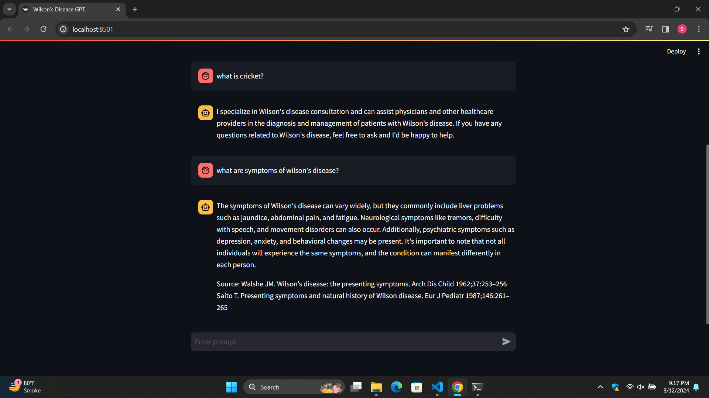

## Wilson's disease chatbot using langchain RAG

Welcome to my Wilson's disease consultant chatbot project.

In this project, I have created a chatbot whose expertise is in wilson's disease consulting.

The tools and technologies we have used in this project are langchain RAG, openAI's GPT 3.5 model,pincone vector DB and streamlit.

### Installing dependencies

To setup this project create a virtual environment and then clone this repository.

Once above step is done, install necessary packages and libraries by executing

- `pip install -r requirements.txt` 

Now that we have installed our packages, next step is to set up environment variables.

### Setting up API keys

Create a file named `.env` and setup following variables:-

- `OPENAI_API_KEY`
- `PINECONE_API_KEY`
- `PINECONE_INDEX_NAME`

### Creating embeddings and storing it in vector DB

Once these are setup, now you can create vector embeddings from pdfs and store it in pinecone vector database.

To do so execute
- `python embeddinngs_pdf.py`

### Executing web app

Once the embeddings are created now we can execute chatbot webapp.

To do so, execute

- `streamlit run app.py`

Below shown images are what our results look like:- 

We have configured our chatbot to generate responses for questions related to topic wilson's disease, hence if won't generate for questions asked out of domain.

On asking questions regarding wilson's disease, the chatbot successfully generates response.

